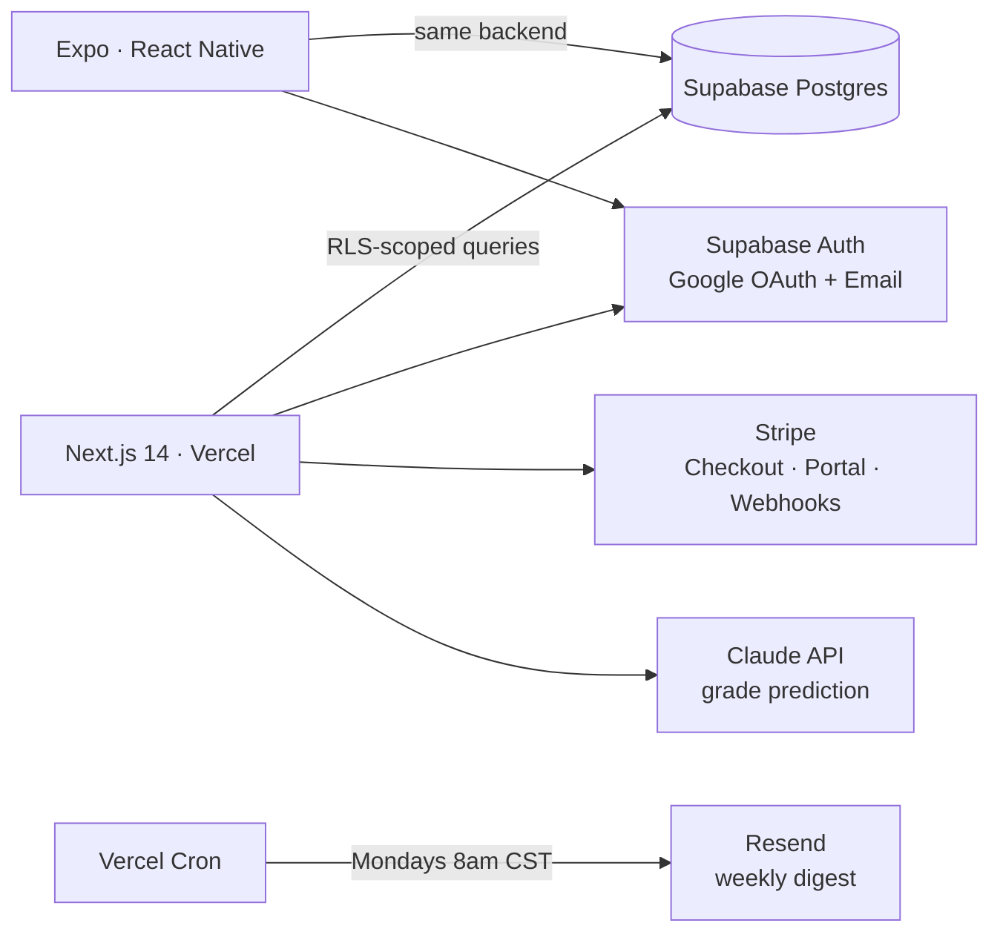

<div align="center">


# Ampliscore

**Know where you stand.**

Grade tracking, GPA planning, AI-powered grade prediction, and professor ratings — built for US college students.

[**ampliscore.app**](https://ampliscore.app)


</div>

---

## What it does

Students enter their courses, grading categories, and assignments once — Ampliscore does the math forever after:

- **Live grade tracking** — weighted category grades computed in real time as scores come in
- **GPA planner** — model "what do I need on the final to keep my scholarship" scenarios before they become emergencies
- **AI grade prediction** — Claude analyzes grade trajectory and category weights to project end-of-semester outcomes
- **Professor ratings** — community ratings shared across universities
- **Weekly digest** — automated Monday-morning email summarizing standing across every course
- **Referral system** — invite 3 friends, unlock Pro

Free plan covers 4 courses; **Pro ($4.99/mo)** unlocks unlimited courses and 5× AI predictions.

## Architecture



**Design decisions worth noting:**

- **Row-Level Security everywhere.** Every table is protected by Postgres RLS with initplan-optimized policies (`(select auth.uid())`), so authorization lives in the database, not scattered across API routes.
- **Server-only privileges.** The Supabase service role key exists exclusively in server-side API routes (webhooks, digest, predictions) — never shipped to a client.
- **Ownership through relations.** Grade categories derive access from their parent course's owner via a policy subquery — no denormalized user IDs where they don't belong.
- **Metered AI.** Prediction usage is tracked per-user with monthly resets, enforcing plan limits server-side.

## Monorepo

```
├── web/      Next.js 14 · TypeScript · Tailwind — live at ampliscore.app
└── mobile/   Expo SDK 54 · React Native — TestFlight in progress
```

Both clients share one Supabase backend, one auth system, and one source of truth.

## Stack

| Layer | Tech |
|---|---|
| Web | Next.js 14 (App Router), TypeScript, Tailwind CSS |
| Mobile | Expo SDK 54, React Native, TypeScript |
| Data & Auth | Supabase (Postgres, RLS, Auth, Storage) |
| Payments | Stripe (Checkout, Billing Portal, Webhooks) |
| AI | Anthropic Claude (Haiku) |
| Email | Resend + Vercel Cron |
| Hosting | Vercel · monitored by UptimeRobot |

## Status

Web app is live and feature-complete. Mobile app (iOS) is in active development targeting TestFlight, with Face ID and Apple Sign In on the roadmap. Built and maintained by a solo founder.

---

<div align="center">
<sub>© 2026 Ampliscore · <a href="https://ampliscore.app/terms">Terms</a> · <a href="https://ampliscore.app/privacy">Privacy</a></sub>
</div>
